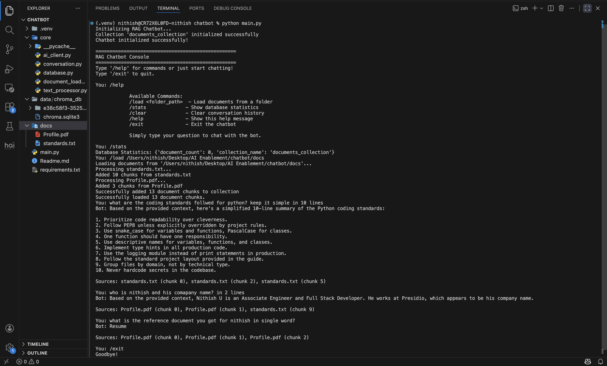

### Chatbot with RAG

#### Demo
- I have provided my resume and Python coding standards as reference documents for the chatbot, which have been loaded into the system
- Documents are read and converted to plain text. Text is split into smaller chunks. Chunks are converted to embeddings using sentence-transformers, then embeddings are stored in ChromaDB for semantic search
- The question is converted to an embedding vector, then ChromaDB compares this vector with all stored document chunk embeddings and returns the 3 most semantically similar document chunks
- The response is then generated by the LLM using the retrieved context and the original query
- For previous conversations, the history is added to contextualize the query. This process repeats for each interaction

